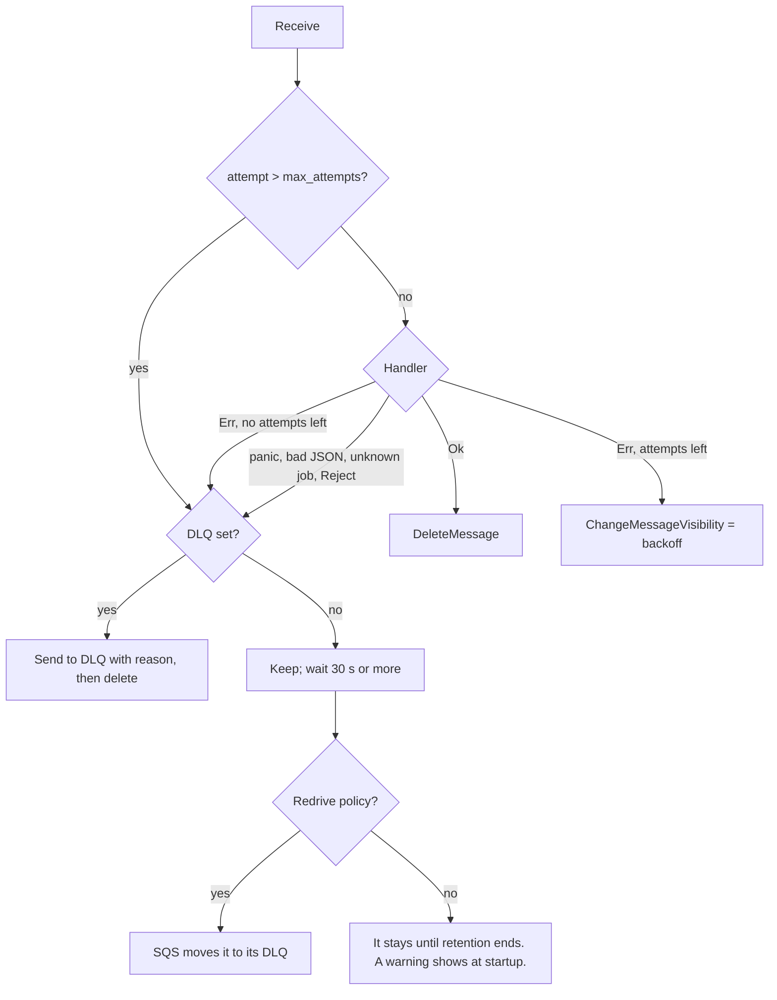

# autumn-plugin-aws-sqs

Amazon SQS plugin for [autumn-web](https://crates.io/crates/autumn-web) 0.7.

- **Jobs.** Send `#[job]` work to SQS. Workers run the same handler.
- **Consumers.** Run a handler for each message on a queue: S3 events, SNS fan-out, other services.
- **Producer.** Send messages to any queue. Batch send. FIFO group and dedup IDs.
- **Operations.** Health indicator, Prometheus metrics, drain on shutdown, role gating.

## Install

```toml
[dependencies]
autumn-web = "0.7"
autumn-plugin-aws-sqs = "0.1"
```

## Configure

Add `[aws_sqs]` to `autumn.toml`:

```toml
[aws_sqs]
region = "us-east-1"

[aws_sqs.queues]
default  = "https://sqs.us-east-1.amazonaws.com/123456789012/app-jobs"
critical = "https://sqs.us-east-1.amazonaws.com/123456789012/app-critical"
dlq      = "https://sqs.us-east-1.amazonaws.com/123456789012/app-dlq"
uploads  = "https://sqs.us-east-1.amazonaws.com/123456789012/app-uploads"

[aws_sqs.jobs]
dead_letter_queue = "dlq"
```

`AwsSqsPlugin::new()` reads the config at startup, like autumn-web does. Later sources win:

1. `[aws_sqs]` in `autumn.toml`.
2. `[profile.<name>.aws_sqs]` in `autumn.toml`.
3. `[aws_sqs]` in `autumn-<profile>.toml`.
4. `.env`, then the process environment: `AUTUMN_AWS_SQS__<PATH>`, with `__` between keys.

```bash
AUTUMN_AWS_SQS__QUEUES__DEFAULT=https://sqs.../app-jobs
AUTUMN_AWS_SQS__WORKER__MAX_IN_FLIGHT=32
```

`AwsSqsPlugin::with_config(config)` uses the config you give. It reads no files and no env vars.

| Key | Default | Meaning |
|---|---|---|
| `region` | AWS chain | AWS region. |
| `endpoint` | none | Custom endpoint, for example LocalStack. |
| `access_key_id_env`, `secret_access_key_env` | none | Names of env vars with static keys. Set both or neither. Neither: use the AWS chain. |
| `queues.<alias>` | none | Queue URL for an alias. |
| `jobs.default_queue` | `"default"` | Alias or URL for jobs whose queue has no alias. |
| `jobs.dead_letter_queue` | none | Alias or URL for dead letters from all workers. |
| `worker.wait_time_secs` | 20 | Long-poll wait (0 to 20). |
| `worker.max_messages` | 10 | Messages per receive (1 to 10). |
| `worker.visibility_timeout_secs` | 30 | Visibility timeout (1 to 43 200). |
| `worker.max_in_flight` | 16 | Handlers that run at the same time, per queue. |
| `worker.heartbeat` | true | Extend visibility while a handler runs. |
| `worker.max_backoff_secs` | 900 | Largest retry backoff (0 to 43 200). |
| `worker.drain_timeout_secs` | 20 | Wait for in-flight handlers at shutdown. |
| `worker.stats_interval_secs` | 30 | Read queue depth for metrics. 0 turns it off. |

## Jobs

Use your `#[job]` functions as they are.

```rust
use autumn_plugin_aws_sqs::{AwsSqsPlugin, SqsJobClient};

#[job(name = "send_welcome_email", max_attempts = 5, backoff_ms = 1000, queue = "critical")]
async fn send_welcome_email(state: AppState, args: WelcomeArgs) -> AutumnResult<()> { Ok(()) }

autumn_web::app()
    .plugin(AwsSqsPlugin::new().jobs(jobs![send_welcome_email]))
    .run()
    .await;

// In a handler:
let jobs = SqsJobClient::from_state(&state)?;
jobs.enqueue(SendWelcomeEmailJob::NAME, &args).await?;
jobs.enqueue_in(SendWelcomeEmailJob::NAME, &args, Duration::from_secs(3600)).await?;
jobs.enqueue_at(SendWelcomeEmailJob::NAME, &args, when).await?;
```

Do not register these jobs with `AppBuilder::jobs`. Then `XJob::enqueue` returns an error. This stops a job from going to the local queue by mistake.

| `#[job]` attribute | Over SQS |
|---|---|
| `name` | Message attribute `autumn-job`. An unknown name gives an error at enqueue and a dead letter at receive. |
| `queue` | Alias in `[aws_sqs.queues]`. With no alias, the job uses the default queue. A warning shows at startup. |
| `max_attempts`, `backoff_ms` | The plugin uses these values. A value of 0 uses `[jobs]` in `autumn.toml` (5 and 250 ms). The backoff is `backoff_ms * 2^(attempt-1)`, rounded up to whole seconds, and `worker.max_backoff_secs` or less. |
| `version`, `upgrade` | The plugin uses the autumn-web payload envelope. |
| `unique`, `concurrency` | Not supported. A warning shows at startup. Use a FIFO `dedup_id` for dedup. |
| `enqueue_tracked` | Not supported. |

The app `JobInterceptor` (`AppBuilder::with_job_interceptor`) wraps each SQS enqueue and each run. Each run has a `job.execute` tracing span.

A job runs only from its own queue. A message that names a job of another queue goes to the dead-letter path.

**Delays.** A delay of 900 s or less uses `DelaySeconds`. For a longer delay, the envelope stores `not_before`. The worker sends the message again every 15 minutes. It stops when the job is due. A hop does not use an attempt. The longest delay is 366 days. FIFO queues do not accept a delay.

## Failure handling



- Delivery is at least once. Make handlers idempotent.
- A dead letter has three attributes: `autumn-dead-letter-reason`, `autumn-source-queue`, and `autumn-attempts`. It keeps up to seven original attributes, so it stays in the SQS limit of 10.
- The reason is 256 characters or less. JSON errors in it have no input values.
- Without `jobs.dead_letter_queue`, set a redrive policy with `maxReceiveCount` equal to `max_attempts` or more.
- Visibility changes stay in the 12 h limit of one receive. A handler that runs longer loses its heartbeat, and the message can run again.

**FIFO queues.** The worker runs the messages of one group in sequence. When a message stays for a retry, the rest of its group waits the same time. So the group keeps its order.

## Consumers

```rust
use autumn_plugin_aws_sqs::{ConsumerError, SqsConsumer, SqsMessage};

async fn on_upload(state: AppState, msg: SqsMessage) -> Result<(), ConsumerError> {
    let event: S3Event = msg.sns_json()?; // or msg.json()?
    // `?` on AutumnError or SqsError retries. Bad JSON rejects.
    Ok(())
}

AwsSqsPlugin::new()
    .consumer(SqsConsumer::new("thumbnails", "uploads", on_upload).max_attempts(3));
```

- Return `ConsumerError::Retry` to try again. Return `ConsumerError::Reject` to dead-letter now.
- Use one handler per queue.
- Defaults: 5 attempts and a 1 000 ms first backoff.

## Producer

```rust
let producer = SqsProducer::from_state(&state)?;
producer.send_json("events", &event).await?;
producer.send("orders", OutboundMessage::new(body).group_id("tenant-7").dedup_id(id)).await?;
let results = producer.send_batch("events", messages).await?; // one result per message
```

`send_batch` takes any number of messages. It sends batches of 10 messages or less and 1 MiB or less.

## Roles and shutdown

- Workers start only when `state.role().runs_workers()` is true (`combined` or `worker`).
- A `web` replica sends jobs and runs no workers.
- When the app drains (`/ready` is 503), the workers stop receiving messages. They wait up to `worker.drain_timeout_secs` for handlers that run.

**Split roles need a `[jobs]` backend value.** autumn-web 0.7 stops a `web` or `worker` process at boot when `[jobs] backend` is `local`. It does this even when the app has no autumn jobs. Set a durable backend name and register no jobs with `AppBuilder::jobs`. autumn then starts no job backend.

```toml
[jobs]
backend = "redis"   # autumn starts no backend: this app has no autumn jobs
```

## Operations

- **Health.** The `aws_sqs` indicator on `/actuator/health` shows the message counts for each queue. An error shows as a class: `not_found`, `access_denied`, `timeout`, or `error`. Call `.readiness(true)` on the plugin to add it to `/ready`.
- **Metrics** on `/actuator/prometheus`, label `queue` (an alias, or `unconfigured` for a raw URL):
  - `aws_sqs_messages_received_total`, `aws_sqs_messages_succeeded_total`, `aws_sqs_messages_retried_total`
  - `aws_sqs_messages_dead_lettered_total`, `aws_sqs_messages_poisoned_total`, `aws_sqs_messages_redrive_deferred_total`
  - `aws_sqs_messages_sent_total`, `aws_sqs_send_errors_total`, `aws_sqs_receive_errors_total`, `aws_sqs_ack_errors_total`
  - `aws_sqs_delay_hops_total`, `aws_sqs_heartbeats_total`
  - `aws_sqs_handlers_in_flight`, `aws_sqs_queue_messages{state="visible|in_flight|delayed"}`
- **IAM.** `sqs:SendMessage`, `sqs:ReceiveMessage`, `sqs:DeleteMessage`, `sqs:ChangeMessageVisibility`, `sqs:GetQueueAttributes`. For SSE-KMS queues, also `kms:GenerateDataKey` and `kms:Decrypt`.

## Tests in your app

```rust
let sqs = MemoryTransport::new().with_queue(url);
let rt = AwsSqsPlugin::with_config(config)
    .with_transport(sqs.clone())
    .jobs(jobs![my_job])
    .start(&state)
    .await?;
// ... enqueue, then check sqs.messages(url) ...
rt.shutdown().await;
```

- `MemoryTransport` follows the SQS rules this crate uses: visibility, receive count, delay, long poll, FIFO groups and dedup, redrive, the 12 h limit, and the size and attribute limits.
- It uses `tokio::time`, so `#[tokio::test(start_paused = true)]` works.
- With `autumn_web::test::TestApp`, give the plugin a `MemoryTransport`. `TestApp` does not run shutdown hooks, so the workers do not drain.

## Harvest

Use Autumn Harvest's SQS connector to start durable workflows. Use this plugin for jobs, plain handlers, and sends.

## License

Apache-2.0.
