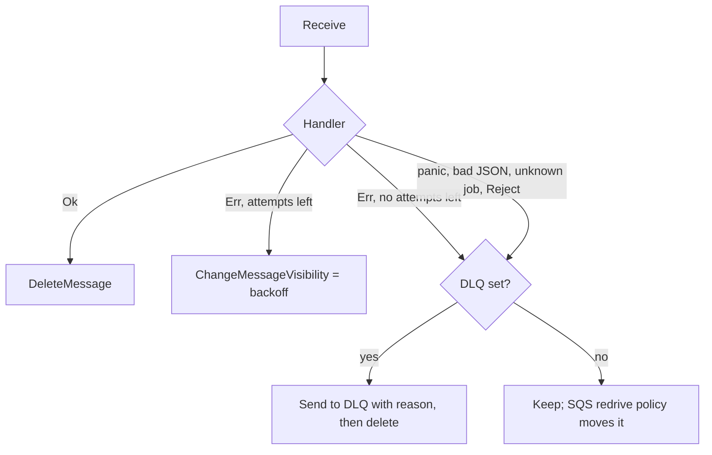

# autumn-plugin-aws-sqs

Amazon SQS plugin for [autumn-web](https://crates.io/crates/autumn-web) 0.7.

- **Jobs.** Send `#[job]` work to SQS. Workers run the same handler.
- **Consumers.** Run a handler for each message on a queue: S3 events, SNS fan-out, other services.
- **Producer.** Send messages to any queue. Batch send. FIFO group and dedup IDs.
- **Operations.** Health indicator, Prometheus metrics, drain on shutdown, role gating.

## Install

```toml
[dependencies]
autumn-web = "0.7"
autumn-plugin-aws-sqs = "0.1"
```

## Configure

Add `[aws_sqs]` to `autumn.toml`:

```toml
[aws_sqs]
region = "us-east-1"

[aws_sqs.queues]
default  = "https://sqs.us-east-1.amazonaws.com/123456789012/app-jobs"
critical = "https://sqs.us-east-1.amazonaws.com/123456789012/app-critical"
dlq      = "https://sqs.us-east-1.amazonaws.com/123456789012/app-dlq"
uploads  = "https://sqs.us-east-1.amazonaws.com/123456789012/app-uploads"

[aws_sqs.jobs]
dead_letter_queue = "dlq"
```

A profile file (for example `autumn-prod.toml`) overrides `autumn.toml`.
Env vars override both: `AUTUMN_AWS_SQS__<PATH>`, with `__` between keys.

```bash
AUTUMN_AWS_SQS__QUEUES__DEFAULT=https://sqs.../app-jobs
AUTUMN_AWS_SQS__WORKER__MAX_IN_FLIGHT=32
```

| Key | Default | Meaning |
|---|---|---|
| `region` | AWS chain | AWS region. |
| `endpoint` | none | Custom endpoint, for example LocalStack. |
| `access_key_id_env`, `secret_access_key_env` | none | Names of env vars with static keys. Set both or neither. Neither: use the AWS chain. |
| `queues.<alias>` | none | Queue URL for an alias. |
| `jobs.default_queue` | `"default"` | Alias or URL for jobs whose queue has no alias. |
| `jobs.dead_letter_queue` | none | Alias or URL for dead letters from all workers. None: the SQS redrive policy moves them. |
| `worker.wait_time_secs` | 20 | Long-poll wait (0 to 20). |
| `worker.max_messages` | 10 | Messages per receive (1 to 10). |
| `worker.visibility_timeout_secs` | 30 | Visibility timeout (1 to 43 200). |
| `worker.max_in_flight` | 16 | Handlers that run at the same time, per queue. |
| `worker.heartbeat` | true | Extend visibility while a handler runs. |
| `worker.max_backoff_secs` | 900 | Largest retry backoff (0 to 43 200). |
| `worker.drain_timeout_secs` | 20 | Wait for in-flight handlers at shutdown. |
| `worker.stats_interval_secs` | 30 | Read queue depth for metrics. 0 turns it off. |
| `health.readiness` | false | Include SQS in `/ready`. |

## Jobs

Use your `#[job]` functions as they are.

```rust
use autumn_plugin_aws_sqs::{AwsSqsPlugin, SqsJobClient};

#[job(name = "send_welcome_email", max_attempts = 5, backoff_ms = 1000, queue = "critical")]
async fn send_welcome_email(state: AppState, args: WelcomeArgs) -> AutumnResult<()> { Ok(()) }

autumn_web::app()
    .plugin(AwsSqsPlugin::from_autumn_toml().jobs(jobs![send_welcome_email]))
    .run()
    .await;

// In a handler:
let jobs = SqsJobClient::from_state(&state)?;
jobs.enqueue(SendWelcomeEmailJob::NAME, &args).await?;
jobs.enqueue_in(SendWelcomeEmailJob::NAME, &args, Duration::from_secs(3600)).await?;
jobs.enqueue_at(SendWelcomeEmailJob::NAME, &args, when).await?;
```

Do not also give these jobs to `AppBuilder::jobs`. Then `XJob::enqueue` fails and does not go to the local queue by mistake.

Rules:

| `#[job]` attribute | Over SQS |
|---|---|
| `name` | Message attribute `autumn-job`. Unknown name: error at enqueue, dead letter at receive. |
| `queue` | Alias in `[aws_sqs.queues]`. No alias: the default queue, with a warning. |
| `max_attempts`, `backoff_ms` | Same meaning. 0 uses `[jobs]` in `autumn.toml` (5 and 250 ms). Backoff is `backoff_ms * 2^(attempt-1)`, rounded up to whole seconds, max `worker.max_backoff_secs`. |
| `version`, `upgrade` | Same envelope as autumn-web. |
| `unique`, `concurrency` | Not supported. Use FIFO `dedup_id` for dedup. |
| `enqueue_tracked` | Not supported. |

Delays of 900 s or less use `DelaySeconds`. A longer delay stores `not_before` and hops: the worker sends the message again every 15 minutes until it is due. A hop does not use an attempt. FIFO queues do not accept a delay.

## Failure handling



Delivery is at least once. Make handlers idempotent.
A dead letter has the attributes `autumn-dead-letter-reason`, `autumn-source-queue`, and `autumn-attempts`.

## Consumers

```rust
use autumn_plugin_aws_sqs::{ConsumerError, SqsConsumer, SqsMessage};

async fn on_upload(state: AppState, msg: SqsMessage) -> Result<(), ConsumerError> {
    let event: S3Event = msg.sns_json()?; // or msg.json()?
    // `?` on AutumnError or SqsError retries. Bad JSON rejects.
    Ok(())
}

AwsSqsPlugin::from_autumn_toml()
    .consumer(SqsConsumer::new("thumbnails", "uploads", on_upload).max_attempts(3));
```

Return `ConsumerError::Retry` to try again. Return `ConsumerError::Reject` to dead-letter now. Use one handler per queue.

## Producer

```rust
let producer = SqsProducer::from_state(&state)?;
producer.send_json("events", &event).await?;
producer.send("orders", OutboundMessage::new(body).group_id("tenant-7").dedup_id(id)).await?;
let results = producer.send_batch("events", messages).await?; // any count, one result per message
```

## Roles and shutdown

- Workers start only when `state.role().runs_workers()` is true (`combined` or `worker`).
- A `web` replica sends jobs and runs no workers.
- When the app drains (`/ready` is 503), workers stop receive. They wait up to `worker.drain_timeout_secs` for in-flight handlers.

## Operations

- Health: indicator `aws_sqs` on `/actuator/health` with per-queue counts. Set `health.readiness = true` to add it to `/ready`.
- Metrics on `/actuator/prometheus`: `autumn_sqs_messages_{received,succeeded,retried,dead_lettered,poisoned,sent}_total`, `autumn_sqs_queue_messages{state}`, and others. Label: `queue`.
- IAM: `sqs:SendMessage`, `sqs:ReceiveMessage`, `sqs:DeleteMessage`, `sqs:ChangeMessageVisibility`, `sqs:GetQueueAttributes`.

## Tests in your app

```rust
let sqs = MemoryTransport::new().with_queue(url);
let rt = AwsSqsPlugin::new(config).with_transport(sqs.clone()).jobs(jobs![my_job]).start(&state).await?;
// ... enqueue, then check sqs.messages(url) ...
rt.shutdown().await;
```

`MemoryTransport` follows visibility, receive count, delay, long poll, FIFO, and redrive. It uses `tokio::time`, so `start_paused = true` works.

## Harvest

Use Autumn Harvest's SQS connector to start durable workflows. Use this plugin for jobs, plain handlers, and sends.

## License

Apache-2.0.
