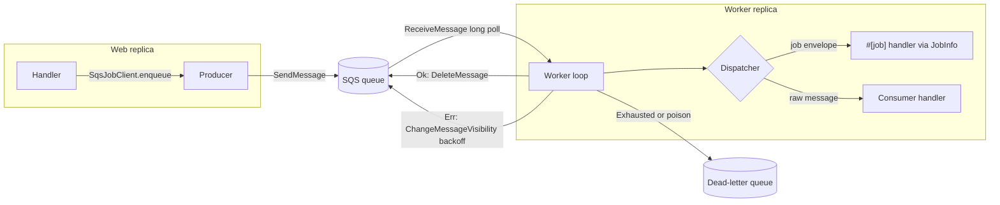

# Plan: `autumn-plugin-aws-sqs`

Style: ASD-STE100. Short sentences. Active voice.

## 1. Problem

Autumn `#[job]` has three backends: `local`, `postgres`, and `redis`.
Teams on AWS often want Amazon SQS.
SQS gives managed durability, dead-letter queues, CloudWatch alarms, and queue-depth autoscaling.
Autumn 0.7.0 has no pluggable job backend.
This plugin adds SQS without an upstream change.

## 2. Autumn footprint (sources)

| Autumn feature | Doc | Plugin use |
|---|---|---|
| `#[job]`, `jobs![]`, `JobInfo` | `jobs` | Reuse job name, handler, `max_attempts`, `backoff_ms`, `queue`, `version`. |
| Process roles | `jobs` | Start workers only when `state.role().runs_workers()`. |
| Graceful drain | `cloud-native` | Stop receive on shutdown. Finish in-flight work. |
| `Plugin` trait | `extensibility` | `AwsSqsPlugin` is a one-line install. |
| `HealthIndicator` | `health-indicators` | Report queue reachability on `/actuator/health`. |
| `MetricsSource` | `metrics-sources` | Export counters and queue depth on `/actuator/prometheus`. |
| Harvest SQS connector | `harvest-broker-connectors` | Harvest starts workflows. This plugin runs plain handlers. No overlap. |
| S3 storage plugin | `storage` | Copy its credential convention (`*_env` pair). |

## 3. Brainstorming (use cases)

1. **SQS transport for `#[job]`** (prime). Web replicas send. Worker replicas receive and run the same handler.
2. **Queue consumers.** Run a handler for messages from S3 events, SNS fan-out, EventBridge, or other services.
3. **Producer.** Send integration events to other services. Batch send. FIFO group and dedup IDs.
4. **Serverless-friendly workers.** Scale a worker tier on `ApproximateNumberOfMessages`.
5. **Operations.** Health indicator, Prometheus metrics, DLQ with redrive.
6. **Local development.** In-memory transport. No AWS account. No Docker.
7. **Later (not in scope):** `#[event]` bridge to SNS, mail delivery queue, outbound webhook buffer.

Selected scope: items 1 to 6.

## 4. Reverse brainstorming (how to make it fail)

| How to fail | Counter-measure |
|---|---|
| Lose a delayed job longer than 15 min (SQS limit is 900 s). | Store `not_before` in the envelope. Hop the message until due. |
| Count a delay hop as a failed attempt. | A hop sends a new message. The receive count starts again. |
| Retry forever. | Stop at `max_attempts`. Send to DLQ. |
| Duplicate work when a handler runs longer than the visibility timeout. | Heartbeat extends visibility while the handler runs. |
| A panic kills the worker loop. | Catch the panic. Dead-letter the message. |
| Unknown job name or bad JSON blocks the queue. | Poison path: dead-letter at once. |
| Web replicas also consume. | Gate workers on `runs_workers()`. |
| Shutdown drops in-flight work. | Stop receive. Wait for in-flight work up to a timeout. |
| Backoff overflows or exceeds 12 h. | Saturating math. Cap at 43 200 s. Proven in the spec. |
| Batch send over 10 entries fails. | Chunk into groups of 10 or less. Report each failed entry. |
| FIFO send without a group ID fails. | Default group ID is the job name. |
| Per-message delay on FIFO fails. | Return a typed error. |
| Leak credentials. | Read keys from named env vars only. Never log them. |
| Partial credential config. | Reject at app startup. |
| Tests need AWS. | `SqsTransport` trait with an in-memory fake. LocalStack for integration tests. |

## 5. Six thinking hats

- **White (facts):** SQS is at-least-once. Standard queues do not keep order. `DelaySeconds` max is 900. Visibility max is 43 200 s. Batch max is 10. FIFO has no per-message delay. Message size max is 1 MiB.
- **Red (feelings):** Users want `#[job]` to "just work" on SQS. A new enqueue call feels less clean than `XJob::enqueue`.
- **Black (risks):** A `JobInterceptor` route loses the due time. A delayed job runs immediately. It also takes the single interceptor slot. We reject it.
  Tracked jobs, `unique`, and `concurrency` attributes do not map to SQS. We document this.
- **Yellow (benefits):** Managed durability. No Redis or Postgres queue tables. Native DLQ. Scales to zero.
- **Green (ideas):** Upstream `JobBackend` seam in autumn-web. Then `XJob::enqueue` routes to SQS. See ADR 0001.
- **Blue (process):** Spec the pure policy core first (Verus). Write failing tests. Implement. Refactor. Review with agents. Check each AC.

## 6. Design

Modules:

- `policy` — pure functions. Backoff, attempt decision, delay split, batch chunking. Verified core.
- `transport` — `SqsTransport` trait, `AwsSqsTransport`, `MemoryTransport`.
- `config` — `SqsConfig` (serde). Validation.
- `envelope` — job message format.
- `producer` — `SqsProducer`.
- `jobs` — `SqsJobClient` and job dispatcher.
- `consumer` — consumer handlers and `SqsMessage`.
- `worker` — receive loop, heartbeat, drain.
- `health`, `metrics` — health indicator and metrics source.
- `plugin` — `AwsSqsPlugin`.

## 7. Acceptance criteria

- **AC1** `AwsSqsPlugin` implements `autumn_web::plugin::Plugin`. One call installs it.
- **AC2** `SqsJobClient` sends a registered `#[job]` with `enqueue`, `enqueue_in`, and `enqueue_at`. A worker runs the same handler.
- **AC3** The worker obeys `max_attempts`, `backoff_ms` (exponential, max 12 h), `queue` to URL routing, and payload `version`.
- **AC4** Delays of 900 s or less use `DelaySeconds`. Longer delays hop. FIFO delays return a typed error.
- **AC5** Failure: retry with visibility backoff. When attempts are exhausted, send to the DLQ. A panic, bad JSON, or an unknown job goes to the DLQ at once.
- **AC6** A heartbeat extends visibility for long handlers.
- **AC7** Consumers run typed handlers for any queue. A helper unwraps SNS envelopes.
- **AC8** The producer sends one message, JSON, or a batch (chunks of 10, per-entry failures). It supports FIFO group and dedup IDs.
- **AC9** Workers start only when `runs_workers()` is true. Shutdown stops receive and drains in-flight work.
- **AC10** A health indicator per queue. A metrics source with counters and queue depth.
- **AC11** Serde config with validation, custom endpoint (LocalStack), and a credential env pair.
- **AC12** `MemoryTransport` is public for app tests.
- **AC13** `cargo fmt`, clippy pedantic and nursery are clean. No `unwrap` in production code. Unit, property, and integration tests pass. Coverage is 85% or more. CI runs these.
- **AC14** Verus specs state the policy invariants. Proofs pass.
- **AC15** README, CLAUDE.md, ADR, and a Mermaid diagram. All docs use ASD-STE100.
